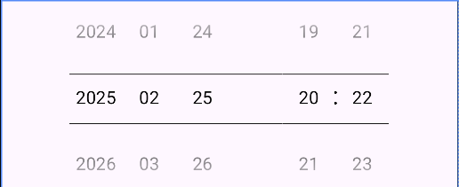
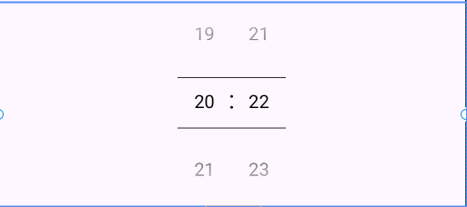
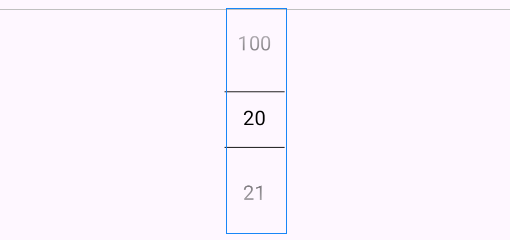

# BasePicker Library for Android


A modern Android library providing a set of customizable pickers for various use cases, such as
Date,
Time, Number, and DateTime pickers. Built with Kotlin, this library enhances the user experience by
offering intuitive and flexible picker components that are easy to integrate and extend.

[](https://opensource.org/licenses/Apache-2.0)
[](https://jitpack.io/#neo-turak/BasePicker)

## Features

- **Customizable Pickers**: Includes `DatePicker`, `DateTimePicker`, `HourMinutePicker`,
  `NumberPicker`, and `TimePicker`.
- **Base Class**: `BasePicker` can be extended for custom picker components.
- **Flexible and Easy Integration**: Quick setup in your Android projects.
- **Lightweight**: Pure Kotlin implementation with no unnecessary dependencies.
- **Modern Design**: Inspired by Material Design principles, supporting dynamic updates and XML
  attributes.
- **Easy Customization**: Various attributes and listeners for customization to meet your app’s
  requirements.

## Components

| Picker Component   | Description                                             |
|--------------------|---------------------------------------------------------|
| `DatePicker`       | A picker for selecting a date (year, month, and day).   |
| `DateTimePicker`   | A picker for selecting both date and time.              |
| `HourMinutePicker` | A picker for selecting hours and minutes.               |
| `NumberPicker`     | A picker for selecting a number from a specified range. |
| `TimePicker`       | A picker for selecting time (hours and minutes).        |
| `BasePicker`       | The base class for creating custom pickers.             |

## Installation

Add the library via JitPack to your project:

### Step 1: Add JitPack Repository

In your **root** `build.gradle.kts` (or `build.gradle`):

```kotlin
allprojects {
    repositories {
        maven { url = uri("https://jitpack.io") }
    }
}
```

### Step 2: Add Dependency

In your **app** build.gradle.kts (or build.gradle):

```groovy

dependencies {
    implementation("com.github.neoturak:picker:TAG")
}

```

Replace **TAG** with the latest release version (e.g., **1.0.0**) or commit hash from GitHub. Check
the [releases page](https://github.com/neoturak/view/releases) or use **main-SNAPSHOT** for the
latest snapshot.

Sync your project, and you’re ready to go!

## Usage

### XML Example

Add a ShapeableImageView with rounded corners, stroke, and gradient:

```xml

<com.github.neoturak.picker.DateTimePicker android:id="@+id/dtp_1"
    android:layout_width="match_parent" android:layout_height="wrap_content"
    android:layout_marginTop="20dp" />
```

### Kotlin Example

Customize a DateTimePicker programmatically:

```kotlin
     val dateTimePicker = DateTimePicker(this)
dateTimePicker.init(2025, 2, 25, 12, 25)
//listener
dateTimePicker.setOnChangedListener(object : DateTimePicker.OnChangedListener {
    override fun onChanged(
        picker: DateTimePicker?,
        year: Int,
        monthOfYear: Int,
        dayOfMonth: Int,
        hourOfDay: Int,
        minute: Int
    ) {

    }

})
```

## Attributes(DateTimePicker)

| Attribute                          | Description                                  | Format    | Default      |
|------------------------------------|----------------------------------------------|-----------|--------------|
| `picker_solidColor`                | Solid background color for the picker        | Color     | Transparent  |
| `picker_selectionDivider`          | Divider color between the selected items     | Color     | Transparent  |
| `picker_selectionDividerHeight`    | Height of the divider between selections     | Dimension | 1dp          |
| `picker_selectionDividersDistance` | Distance between the selection dividers      | Dimension | 0dp          |
| `picker_internalMinHeight`         | Minimum height of the internal picker layout | Dimension | 0dp          |
| `picker_internalMaxHeight`         | Maximum height of the internal picker layout | Dimension | Match_Parent |
| `picker_internalMinWidth`          | Minimum width of the internal picker layout  | Dimension | 0dp          |
| `picker_internalMaxWidth`          | Maximum width of the internal picker layout  | Dimension | Match_Parent |
| `picker_internalLayout`            | Custom internal layout for the picker        | Resource  | None         |
| `picker_selectionTextSize`         | Text size for the selected item              | Dimension | 16sp         |
| `picker_selectionTextColor`        | Text color for the selected item             | Color     | Black        |
| `picker_startYear`                 | Start year for the DatePicker                | Integer   | 1900         |
| `picker_endYear`                   | End year for the DatePicker                  | Integer   | 2100         |
| `picker_minDate`                   | Minimum date that can be selected            | Date      | 01/01/1900   |
| `picker_maxDate`                   | Maximum date that can be selected            | Date      | 31/12/2100   |

## Attributes(DatePicker)

| Attribute                          | Description                                  | Format    | Default      |
|------------------------------------|----------------------------------------------|-----------|--------------|
| `picker_solidColor`                | Solid background color for the picker        | Color     | Transparent  |
| `picker_selectionDivider`          | Divider color between the selected items     | Color     | Transparent  |
| `picker_selectionDividerHeight`    | Height of the divider between selections     | Dimension | 1dp          |
| `picker_selectionDividersDistance` | Distance between the selection dividers      | Dimension | 0dp          |
| `picker_internalMinHeight`         | Minimum height of the internal picker layout | Dimension | 0dp          |
| `picker_internalMaxHeight`         | Maximum height of the internal picker layout | Dimension | Match_Parent |
| `picker_internalMinWidth`          | Minimum width of the internal picker layout  | Dimension | 0dp          |
| `picker_internalMaxWidth`          | Maximum width of the internal picker layout  | Dimension | Match_Parent |
| `picker_internalLayout`            | Custom internal layout for the picker        | Resource  | None         |
| `picker_selectionTextSize`         | Text size for the selected item              | Dimension | 16sp         |
| `picker_selectionTextColor`        | Text color for the selected item             | Color     | Black        |
| `picker_startYear`                 | Start year for the DatePicker                | Integer   | 1900         |
| `picker_endYear`                   | End year for the DatePicker                  | Integer   | 2100         |
| `picker_showDay`                   | Whether to show the day picker               | Boolean   | true         |
| `picker_minDate`                   | Minimum date that can be selected            | Date      | 01/01/1900   |
| `picker_maxDate`                   | Maximum date that can be selected            | Date      | 31/12/2100   |

I have just convert the Java file to Kotlin, lets just keep what attribute is.

## Attributes (NumberPicker)

| Attribute                            | Description                                                          | Format    | Default                 |
|--------------------------------------|----------------------------------------------------------------------|-----------|-------------------------|
| `np_width`                           | Width of the number picker                                           | Dimension | Match_Parent            |
| `np_height`                          | Height of the number picker                                          | Dimension | Wrap_Content            |
| `np_accessibilityDescriptionEnabled` | Whether accessibility description is enabled                         | Boolean   | false                   |
| `np_divider`                         | Divider drawable for the picker                                      | Resource  | None                    |
| `np_dividerType`                     | Type of divider used                                                 | Enum      | side_lines              |
| `np_dividerColor`                    | Color of the divider                                                 | Color     | Black                   |
| `np_dividerDistance`                 | Distance between the dividers                                        | Dimension | 0dp                     |
| `np_dividerLength`                   | Length of the divider                                                | Dimension | Match_Parent            |
| `np_dividerThickness`                | Thickness of the divider                                             | Dimension | 1dp                     |
| `np_fadingEdgeEnabled`               | Whether fading edge effect is enabled                                | Boolean   | false                   |
| `np_fadingEdgeStrength`              | Strength of the fading edge effect                                   | Float     | 0.5f                    |
| `np_formatter`                       | Formatter string for number values                                   | String    | None                    |
| `np_hideWheelUntilFocused`           | Whether the wheel is hidden until focused                            | Boolean   | false                   |
| `np_itemSpacing`                     | Spacing between items in the picker                                  | Dimension | 16dp                    |
| `np_lineSpacingMultiplier`           | Multiplier for line spacing                                          | Float     | 1.0f                    |
| `np_max`                             | Maximum value of the picker                                          | Integer   | 100                     |
| `np_maxFlingVelocityCoefficient`     | Coefficient for maximum fling velocity                               | Integer   | 2                       |
| `np_min`                             | Minimum value of the picker                                          | Integer   | 0                       |
| `np_order`                           | Order in which items appear                                          | Enum      | ascending               |
| `np_orientation`                     | Orientation of the picker                                            | Enum      | horizontal              |
| `np_scrollerEnabled`                 | Whether scroller effect is enabled                                   | Boolean   | true                    |
| `np_selectedTextAlign`               | Text alignment for the selected item                                 | Enum      | selectedTextAlignCenter |
| `np_selectedTextColor`               | Text color for the selected item                                     | Color     | Black                   |
| `np_selectedTextSize`                | Text size for the selected item                                      | Dimension | 16sp                    |
| `np_selectedTextStrikeThru`          | Whether to strike through the selected text                          | Boolean   | false                   |
| `np_selectedTextUnderline`           | Whether to underline the selected text                               | Boolean   | false                   |
| `np_selectedTypeface`                | Typeface for the selected item                                       | String    | Default                 |
| `np_textAlign`                       | Text alignment for the unselected items                              | Enum      | textAlignCenter         |
| `np_textColor`                       | Text color for the unselected items                                  | Color     | Black                   |
| `np_textSize`                        | Text size for the unselected items                                   | Dimension | 14sp                    |
| `np_textStrikeThru`                  | Whether to strike through the unselected text                        | Boolean   | false                   |
| `np_textUnderline`                   | Whether to underline the unselected text                             | Boolean   | false                   |
| `np_typeface`                        | Typeface for the unselected items                                    | String    | Default                 |
| `np_value`                           | Current value of the picker                                          | Integer   | 0                       |
| `np_wheelItemCount`                  | Number of items to show in the wheel                                 | Integer   | 5                       |
| `np_wrapSelectorWheel`               | Whether to wrap the wheel when reaching the minimum or maximum value | Boolean   | true                    |

## Screenshots

| DateTimePicker                        | HourMinutePicker                        | NumberPicker                       |
|---------------------------------------|-----------------------------------------|------------------------------------|
|  |  |  |

## Contributing

We welcome contributions! To contribute:

1. Fork the repository.
2. Create a feature branch (git checkout -b feature/awesome-addition).
3. Commit your changes (git commit -m "Add awesome feature").
4. Push to the branch (git push origin feature/awesome-addition).
5. Open a Pull Request.

Please follow the [Code of Conduct](CODE_OF_CONDUCT.md) and check
the [CONTRIBUTING.md](CONTRIBUTING.md) for guidelines.

## License

This library is licensed under the Apache License 2.0. See the [LICENSE](LICENSE) file for details.

```
Copyright 2025 NeoTurak

Licensed under the Apache License, Version 2.0 (the "License");
you may not use this file except in compliance with the License.
You may obtain a copy of the License at

    http://www.apache.org/licenses/LICENSE-2.0

Unless required by applicable law or agreed to in writing, software
distributed under the License is distributed on an "AS IS" BASIS,
WITHOUT WARRANTIES OR CONDITIONS OF ANY KIND, either express or implied.
See the License for the specific language governing permissions and
limitations under the License.
```

## Acknowledgments

- Inspired by [BasePicker](https://github.com/react-native-picker/picker) for the
  circular image implementation.
- Built with ❤️ for the Android developer community.